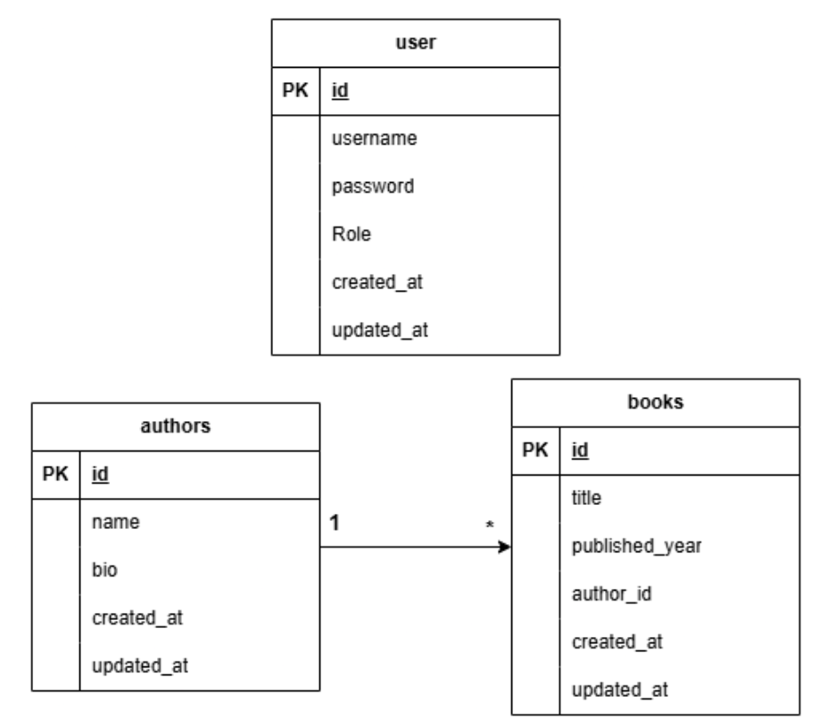

## Description

A simple admin panel built with **NestJS MVC** for managing **Authors** and **Books** with **JWT-based authentication**.  
The project demonstrates:

- Login / Register with JWT (cookie-based)
- Admin panel (HTML pages) for CRUD Authors & Books
- One-to-many relation (Author → Books)
- Search feature on list pages
- Dedicated JSON API endpoints for Postman testing

## Features

- **Authentication**
  - Register & Login (web + API)
  - JWT stored in HTTP-only cookie
  - Protected routes using `JwtAuthGuard` and `@Public()` decorator

- **Admin panel (HTML pages)**
  - Dashboard: list books + search
  - Authors: list, create, edit, delete, detail (with list of books)
  - Books: list, create (with author dropdown), edit, delete, detail (with author info)

- **API (JSON, for Postman)**
  - Auth: `/api/register`, `/api/login`, `/api/logout`
  - Authors: `/api/authors`, `/api/authors/:id`
  - Books: `/api/books`, `/api/books/:id`

---

## Database Design

Relational database using **MySQL** with three main tables:

- **users**
  - `id` (PK)
  - `email` (unique)
  - `password` (hashed with bcrypt)
  - `role` (default: `user`)

- **authors**
  - `id` (PK)
  - `name`
  - `bio` (text, nullable)
  - `created_at`
  - `updated_at`

- **books**
  - `id` (PK)
  - `title`
  - `published_year`
  - `author_id` (FK → authors.id)
  - `created_at`
  - `updated_at`

**Relationship:**

- One **Author** has many **Books**.
- Each **Book** belongs to exactly one **Author**.



## Dependencies
Main dependencies used in this project:
- **Core**
  - @nestjs/common, @nestjs/core, @nestjs/platform-express
  - reflect-metadata, rxjs

- **Database**
  - typeorm @nestjs/typeorm
  - mysql2

- **Authentication & Security**
  - @nestjs/jwt
  - @nestjs/passport
  - passport, passport-jwt
  - bcrypt
  - cookie-parser

- **View Engine**
  - handlebars


# Getting Started

## Prerequisites

Make sure you have installed:

- Node.js (v18+ recommended)
- MySQL (running locally)
- Git

---

## Setup

```bash
# 1. Clone repository
git clone <REPO_URL>
cd nestjs-mvc

# 2. Install dependencies
npm install

# 3. Setup database
# - Create database `nestjs_mvc` in MySQL
# - Adjust DB config in `src/app.module.ts` if needed (host, port, username, password)

# 4. Run application (development)
npm run start:dev
```

Application will run on: `http://localhost:3000`

---

## Default URLs

### Web pages

- `/login`, `/register`
- `/` (dashboard)
- `/authors`, `/authors/create`, `/authors/:id`, `/authors/:id/edit`
- `/books`, `/books/create`, `/books/:id`, `/books/:id/edit`

### API endpoints (for Postman)

- **Auth**
  - `POST /api/register`
  - `POST /api/login`
  - `POST /api/logout`

- **Authors**
  - `GET /api/authors`
  - `GET /api/authors/:id`
  - `POST /api/authors`
  - `PATCH /api/authors/:id`
  - `DELETE /api/authors/:id`

- **Books**
  - `GET /api/books`
  - `GET /api/books/:id`
  - `POST /api/books`
  - `PATCH /api/books/:id`
  - `DELETE /api/books/:id`

### API Documentation (Postman)

- This project includes a Postman collection file that can be imported directly into Postman:
  - `api-postman.json` (or the corresponding collection file in the repository).
- To use it:
  1. Open Postman.
  2. Go to **File → Import**.
  3. Select the `api-postman.json` collection file from this repository.
  4. After importing, all `/api/...` endpoints (Auth, Authors, Books) will be available and ready to test.

---

## Project Structure (simplified)

```text
src/
  app.module.ts
  app.controller.ts
  app.service.ts
  main.ts

  auth/
    auth.module.ts
    auth.controller.ts       # HTML login/register
    auth.api.controller.ts   # JSON API for auth (Postman)
    auth.service.ts
    auth.middleware.ts
    jwt.strategy.ts
    jwt-auth.guard.ts
    public.decorator.ts

  authors/
    authors.module.ts
    authors.entity.ts
    authors.service.ts
    authors.controller.ts        # HTML pages
    authors.api.controller.ts    # JSON API

  books/
    books.module.ts
    books.entity.ts
    books.service.ts
    books.controller.ts          # HTML pages
    books.api.controller.ts      # JSON API

  users/
    users.module.ts
    users.entity.ts
    users.service.ts

views/
  auth/...
  authors/...
  books/...
  layout.hbs
  auth-layout.hbs
  partials/sidebar.hbs
```

---

## Notes for Future Developers

- DB schema is auto-synchronized by TypeORM (`synchronize: true`) for development.  
  For production, consider using migrations instead.
- Authentication uses JWT stored in HTTP-only cookies, combined with:
  - `JwtAuthGuard` as global guard.
  - `@Public()` for routes that can be accessed without login.
  - `AuthMiddleware` to inject `user` into `req` and `res.locals`.
- There are separate controllers for:
  - HTML pages (MVC views).
  - JSON APIs (for Postman / external clients).
- When extending the project:
  - Add new entity → create module + service + controller (page/API) following the same pattern.
  - Add new fields in a table → update entity + view + body handling in controllers/APIs.
